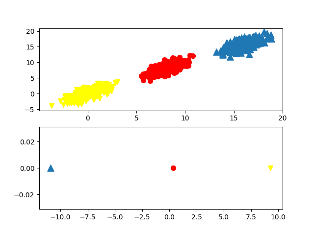

# Ch13 - 利用PCA来简化数据(Using principal component analysis to simplify data)

#### 大量的数据往往拥有超出显示能力的更多特征，但数据显示并非大规模特征下的唯一难题，对数据进行简化也很重要，它可以：
```
使得数据集更易使用。
降低很多算法的计算开销。
去除噪声。
使得结果易懂。
```
## 第一种降维的方法称为主成分分析(Principal Component Analysis,PCA)。
#### 在PCA中,数据从原来的坐标系转换到了新的坐标系,新坐标系的选择是由数据本身决定的。第一个新坐标轴选择的是原始数据中方差最大的方向，第二个新坐标轴的选择和第一个坐标轴正交且具有最大方差的方向。该过程一直重复，重复次数为原始数据中特征的数目。我们会发现，大部分方差都包含在最前面的几个新坐标轴中。因此，我们可以忽略余下的坐标轴，即对数据进行了降维处理。

## 另外一种降维技术是因子分析(Factor Analysis)。
#### 在因子分析中,我们假设在观察数据的生成中有一些观察不到的隐变量(latent variable)。假设观察数据是这些隐变量和某些噪声的线性组合。那么隐变量的数据可能比观察数据的数目少,也就是说通过找到隐变量就可以实现数据的降维。

## 还有一种降维技术就是独立成分分析(Independent Component Analysis,ICA)。
#### ICA假设数据是从 N 个数据源生成的,这一点和因子分析有些类似。假设数据为多个数据源的混合观察结果，这些数据源之间在统计上是相互独立的，而在PCA中只假设数据是不相关的。同因子分析一样，如果数据源的数目少于观察数据的数目，则可以实现降维过程。

### 数据集


### 降维(一)


### 降维(二)


### 总方差的百分比

