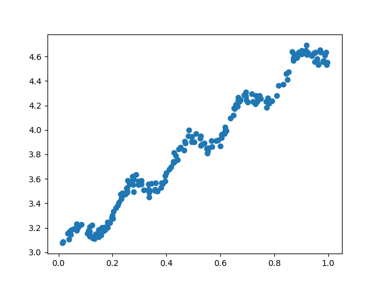
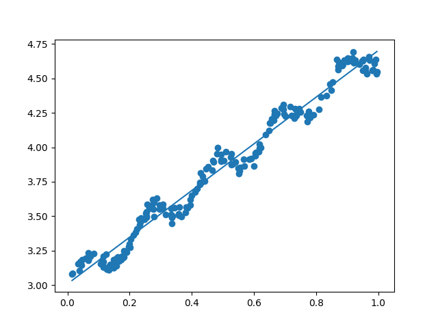

# Ch08 - 预测数值型数据：回归(Predicting numeric values: regression)

### 本章讲的是线性回归，就是找出一系列的回归系数，和Logistic回归很像，但是去掉了sigmoid函数。说到回归，一般指的是线性回归。

### 假如回归系数放在向量w中，这个w可以用普通最小二乘法（OLS），通过使用numpy库的几个函数即可（注意：如果没有检查行列式是否为0就计算矩阵的逆，就会出现错误，使用linalg函数即可）。比如给我们一些数据(ex0.txt)，下图是它们的散点图。

### 通过标准回归函数和数据导入函数，就是使用最小二乘法。得到下图的最佳拟合直线，其实也不是“最佳”，因为这种线性回归会出现欠拟合的情况。

### 线性回归中会出现欠拟合的情况，因为它求的是具有最小均方误差的无偏估计。欠拟合可不会有最好的预测效果。面对这种情况，因此，我们需要在估计中引入一些偏差， 从而降低误差。其中一个方法就是局部加权线性回归 (LWLR)。
### LWLR通常使用核来对附近的点赋予更高的权重，最常用的是高斯核。k是高斯核对应的权重中的一个参数。下面3个图分别是k=1.0，k=0.01，k=0.003三种不同取值下的效果图。

## k = 1.0
.png)

## k = 0.01
.png)

## k= 0.003
.png)
